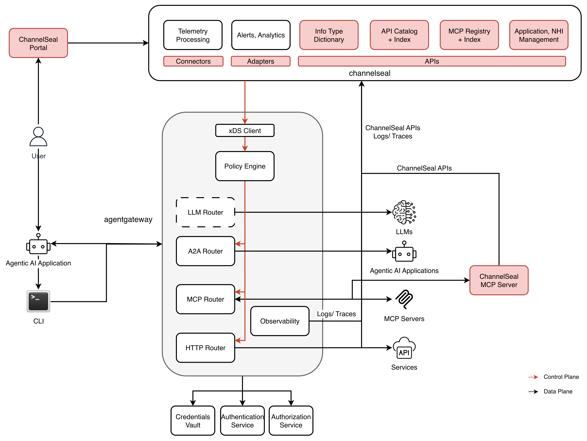

# channelseal.ai

AI-powered visibility and control over Agentic AI integration traffic.

### Key Capabilities

*  **Discovery** of shadow Agentic AI integrations and shadow NHIs from traffic metadata without looking into payload
* **Visibility** on sensitive data and NHI over Agentic AI integrations
* **Control** using policy(s) for sensitive data in transit over HTTP API, MCP and A2A traffic.
* **API**
  * **API Inventory** Enterprise's inventory of private, public, partner and vendor APIs specified using various specifications including OpenAPI, Swagger, GraphQL and WSDL.
  * **Public API Catalog** Catalog of publicly available widely used APIs linted and scored using authenticity check and business capabilities. 
  * **AI-powered API Index** AI-powered index of API integrations for discovering sensitive data exposure, data classification, NHIs and business capabilities.
* **Event**
  * Enterprise's inventory of private, public, partner and vendor messages/ events specified using OpenAPI or AsyncAPI
  * Event listeners using protocols such as HTTP, Kafka, MQTT, WebSockets, etc. 
* **MCP**
  * **MCP Registry** Enterprise's inventory of private, public, parnter and vendor MCP servers
  * **AI-powered MCP Tool Index** AI-powered index of MCP tools (and resources) for discovering sensitive data exposure, data classification, NHIs and business capabilities.

#### Capabilities from agentgateway

agentgateway is an open source (Linux foundation, Apache2 license) proxy built on AI-native protocols ([MCP](https://modelcontextprotocol.io/introduction) & [A2A](https://developers.googleblog.com/en/a2a-a-new-era-of-agent-interoperability/)) that provides drop-in security, observability, and governance for agent-to-LLM, agent-to-tool, agent-to-API, and agent-to-agent communication across any framework and environment.

* **Protocol Support:** agentgateway supports multiple protocols including the Agent2Agent Protocol (A2A) for enabling specialized agents to cooperate on complex tasks, the Model Context Protocol (MCP) which standardizes how AI agents connect and share data with external tools and systems and HTTP that is the backbone of integrations using different types of APIs (REST, GraphQL, WSDL, etc.).
* **Cost & Performance:** provides token-based rate limiting per user, team, or API key, fine-grained budget enforcement with denial-of-wallet protection, per-model cost attribution and real-time consumption dashboards, and model failover to optimize for price, performance, and availability. (enterprise paid capability)
* **Security & Governance:** a drop-in solution transparent to agents and tools to secure, govern, and audit agent, API and tool communications. Auth (JWT, API keys, OAuth), fine-grained RBAC with CEL policy engine, rate limiting and TLS. Plug in providers for credential management, authentication and authorization. (enterprise paid capability)
* **Observability:** OpenTelemetry metrics/logs/tracing.
* **Deployment:** 
  * Platform-agnostic, runs on bare metal, VMs, containers, or Kubernetes 
  * Implements the Kubernetes Gateway API with support for HTTPRoute, GRPCRoute, TCPRoute, and TLSRoute

**Linux Foundation**

The Linux Foundation accepted agentgateway in August 2025, with contributors from AWS, Cisco, Huawei, IBM, Microsoft, Red Hat, Shell and Zayo [Linux Foundation](https://www.linuxfoundation.org/press/linux-foundation-welcomes-agentgateway-project-to-accelerate-ai-agent-adoption-while-maintaining-security-observability-and-governance). The project became part of the Linux Foundation with broad support from Microsoft, T-Mobile, Dell, CoreWeave, and Akamai, achieving over 1,000 GitHub stars in the first six months.

### API Indexing Pipeline

- Maintainer/ Provider verification for authenticity
- Source ingestion
- Re-scan cadence
- Linting
- API definition quality score (ADQS)

### MCP Server Indexing Pipeline
- Maintainer/ Provider verification for authenticity
- Source ingestion
- Re-scan cadence
- Linting
- Protocol introspection
- Behavioral analysis
- Tool definition quality score (TDQS)

Some credits: [Glama.ai](https://glama.ai/mcp/methodology)

### Event Indexing Pipeline
- Maintainer/ Provider verification for authenticity
- Source ingestion
- Re-scan cadence
- Linting
- Event definition quality score (EDQS)

### Terms used
- API Linting: API linting is the process of analyzing API specifications (such as OpenAPI or AsyncAPI) against a predefined set of rules and best practices to enforce consistency, style, and governance before deployment.  Unlike validation, which checks if an API functions as intended, linting focuses on stylistic choices and compliance with organizational guidelines, such as ensuring consistent naming conventions (e.g., camelCase vs. snake_case), mandatory field descriptions, proper error status codes, "approved" security schemes, data governance, etc. 