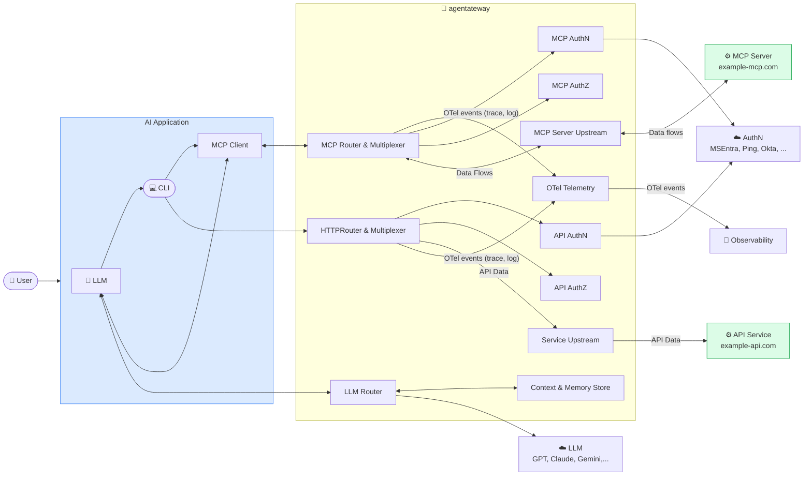

## agentgateway + channelseal

```mermaid
flowchart LR
    User([👤 User]) --> Host
    subgraph Host["AI Application"]
        LLM --> CLI
        LLM <--> MCPClient
        CLI([💻 CLI]) --> MCPClient[MCP Client]
    end
    CLI --> HTTPRouter
    LLM[🧠 LLM]<-->LLMR
    MCPClient <--> MCPRouter

    subgraph AgentGateway["🔀 agentateway"]
        LLMR[LLM Router]
        Memory[Context & Memory Store]
        LLMR <--> Memory
        MCPRouter --OTel events (trace, log)--> Obs[OTel Telemetry]
        MCPRouter[MCP Router & Multiplexer]
        MCPRouter --> MCPAuthN[MCP AuthN]
        MCPRouter --> MCPAuthZ[MCP AuthZ]
        MCPRouter <--Data Flows--> MCPSUpstream[MCP Server Upstream]
        HTTPRouter[HTTPRouter & Multiplexer]
        HTTPRouter --> APIAuthN[API AuthN]
        HTTPRouter --> APIAuthZ[API AuthZ]
        HTTPRouter --API Data--> APIUpstream[Service Upstream]
        HTTPRouter --OTel events (trace, log)--> Obs[OTel Telemetry]
    end
    MCPSUpstream <--Data flows-->MCPServer["⚙️ MCP Server <br>example-mcp.com"]
    Obs --OTel events--> Observability["👀 Observability"]
    APIUpstream --API Data-->APIServer["⚙️ API Service <br>example-api.com"]
    LLMR --> LLMProviders["☁️ LLM " <br> GPT, Claude, Gemini,... ]
    MCPAuthN-->AuthNProviders["☁️ AuthN " <br> MSEntra, Ping, Okta, ... ]
    APIAuthN-->AuthNProviders
    style Host fill:#dbeafe,stroke:#3b82f6
    style MCPServer fill:#dcfce7,stroke:#16a34a
    style APIServer fill:#dcfce7,stroke:#16a34a
```