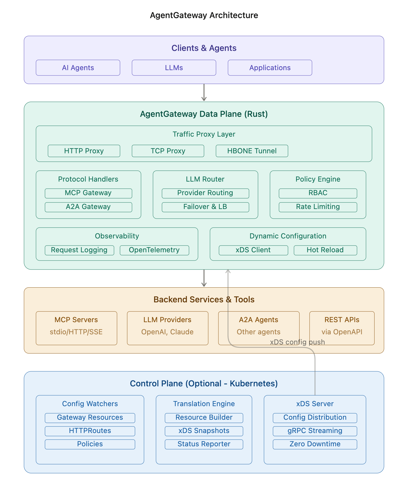
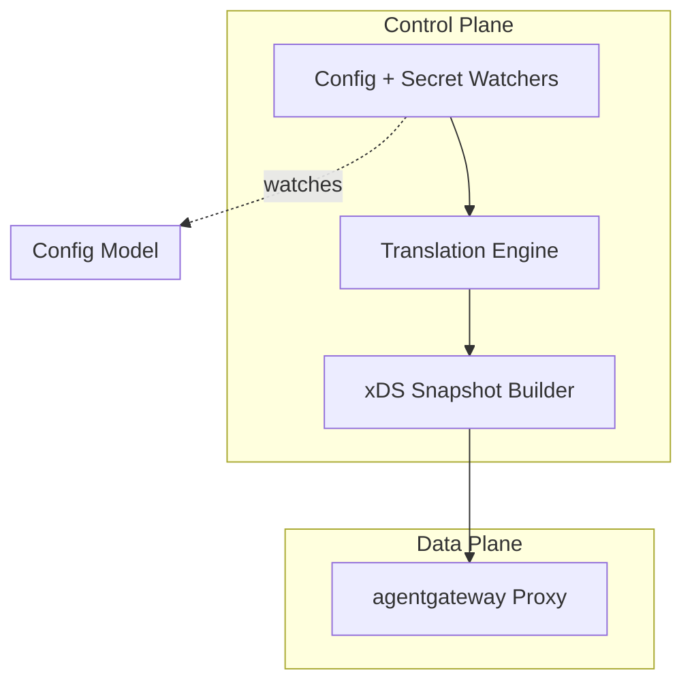
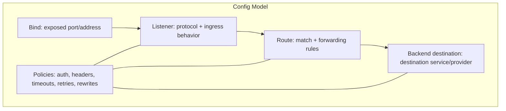
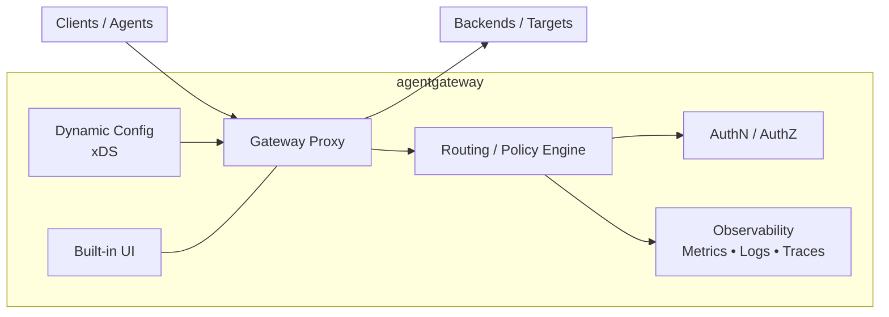
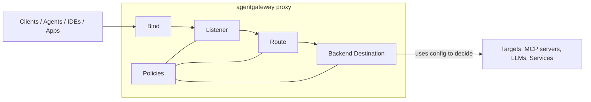
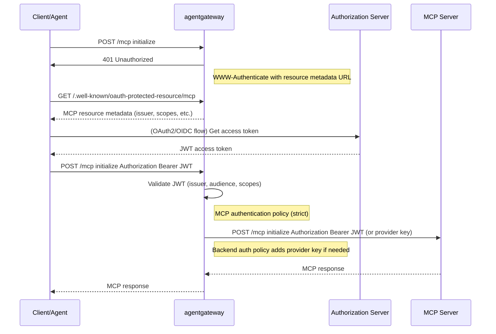
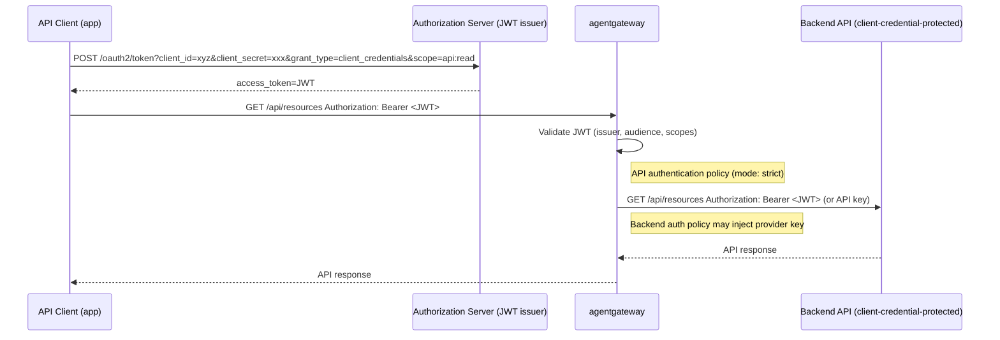
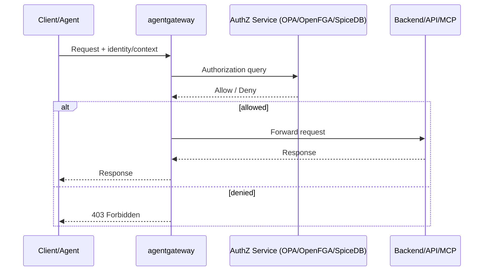

## agentgateway Architecture

### High-Level Architecture

agentgateway is an open-source, high-performance data plane written in Rust that provides connectivity, security, and observability for agentic AI systems, serving as a unified gateway for Agent-to-Agent (A2A) communication, Model Context Protocol (MCP), LLM Gateway services, and traditional HTTP/gRPC traffic.



Diagram generated by Claude from agentgateway github

### Core Components

agentgateway’s architecture is a control-plane/data-plane design: 
* The control plane watches configuration and secrets, translates Kubernetes/Gateway resources into agentgateway-specific proxy config, and then pushes an xDS snapshot to the data plane, 
* The data plane is the agentgateway proxy serving live traffic.

## 1. Control Plane (Kubernetes Mode)

The control plane includes a config watcher that watches for new Kubernetes Gateway API and agentgateway resources, a secret watcher that monitors secret stores, a translator that converts resources into gateway proxy configuration stored in xDS snapshots, and an xDS server that distributes configuration to gateway proxies.

### Translation & Distribution

The translation cycle starts by collecting Kubernetes, Gateway API, and `kgateway` resources defined in the cluster (such as namespaces, services, gateways, routes, policies, backends), then translates this core collection into agentgateway data plane resource format including bind, port, listener, route, backend, target, and policy configuration.



### Configuration Model

The architecture uses a hierarchical configuration model.

**Core Building Blocks:**

agentgateway's core configuration consists of the following:

* Listeners (entry points for incoming traffic on ports supporting HTTP, HTTPS, TCP, and TLS protocols)
* Routes (rules that match incoming requests and forward them to backends based on path, hostname, headers, query parameters, and HTTP methods)
* Backends (destination services that receive traffic, which can be static hosts, MCP servers, LLM providers, or other services).




## 2. Data Plane (Rust Core)




### Gateways

#### Proxy

The gateway core consists of two main proxy implementations:

* HTTPProxy which handles HTTP/1.1, HTTP/2, and HTTPS traffic with full request/response processing, policy enforcement, and protocol-specific routing
* TCPProxy which handles raw TCP connections for non-HTTP protocols like TLS passthrough.

agentgateway provides four specialized gateway types:
* LLM Gateway for routing traffic to major LLM providers through a unified OpenAI-compatible API with budget controls and failover;
* MCP Gateway for connecting LLMs to tools via MCP with tool federation and OAuth authentication;
* A2A Gateway for secure agent-to-agent communication with capability discovery
* Inference Routing for intelligent routing to self-hosted models using Kubernetes extensions.


### Modular Architecture

* Binds define the network entry points, such as ports that the proxy should listen on.
* Listeners sit on top of binds and define protocol-aware ingress handling for HTTP, HTTPS, TCP, and TLS traffic.
* Routes live inside listeners and decide how requests are matched and forwarded using hostnames, paths, headers, query parameters, and methods.
* Backends are the destinations, including static hosts, MCP servers, LLM providers, or other services.

The model including Bind, Listener, Route, Backend, and Target, provides modular architecture allowing each component (gateway, policy enforcement) to operate independently while sharing common configuration and telemetry foundation.

### Request Processing


A request enters through a bind and listener, gets matched to a route, has listener/route policies applied, and is then forwarded to a backend where backend-specific policies can run. In practice, this makes agentgateway a declarative traffic control plane for agent and model traffic rather than just a simple proxy.

#### Example shape
A typical config looks like this: one bind on port 3000, one listener with an API-key policy, one route with a transformation policy, and one backend with backend auth.

## Policy Architecture

### Three-Phase Policy Model

Policies in agentgateway control request and response processing at three distinct phases: 
* Frontend Policies applied at the connection/listener level controlling TLS, TCP, HTTP protocol settings, logging, and tracing; 
* Traffic Policies applied at the route level controlling authentication, authorization, rate limiting, CORS, transformations, and routing decisions; and 
* Backend Policies applied at the backend level controlling backend authentication, TLS, protocol-specific handling (LLM, MCP, A2A), and backend transformations.

### Policy Categories

Policies are grouped into functional categories, with each category mapping to one or more configuration fields and a corresponding Rust module in the data plane, supporting modes like 
* Strict (token required)
* Optional (validate if present)
* Permissive (never reject).

### Listener policies
Listener policies apply at the ingress entry point, so they are good for things that should affect all traffic accepted by that listener. Examples include:
* TLS enforcement, requiring encrypted transport before any request is processed.
* Certificate selection, choosing the cert for the inbound TLS connection.
* Global auth or request constraints, such as requiring an API key for every request on that listener.

### Route policies
Route policies apply after a request matches a listener route, so they are useful for behavior tied to a specific path, host, or request pattern. Examples include:
* Header or query rewriting, to transform requests before forwarding.
* Route-specific auth, allowing one route to require stronger checks than another.
* Per-route retries or timeouts, so one backend path can be more tolerant than another.

### Backend policies
Backend policies apply at the destination, so they are best for requirements tied to a particular upstream service or model provider. Examples include:
* Backend authentication, such as adding credentials needed to talk to OpenAI, Anthropic, or an MCP server.
* Health checks / reachability controls, so the gateway knows whether a backend is usable.
* Provider-specific connection settings, such as endpoint URL, transport, or secret-backed config.


## Observability & Telemetry

All telemetry is generated by the RequestLog system that tracks requests from arrival through completion, including token counts for LLM requests and session IDs for MCP interactions.

## Security

### Authentication

#### MCP Server Call

In agentgateway, authentication with a provider (MCP server) is modeled by having agentgateway act as a resource‑server‑style proxy: it enforces JWT‑based OAuth for the MCP route, validates tokens, and then forwards traffic to the MCP backend, optionally with its own backend‑auth credentials to the provider.




MCP Authentication policy (listener/route)
* Enforces `strict` / `optional` / `permissive` JWT validation on the MCP route.
* On first request without a valid token, returns `401` with `WWW-Authenticate` pointing to the MCP Protected Resource Metadata URL (RFC‑9728‑style).
* agentgateway as resource‑server proxy
  * Validates the JWT using the configured issuer and JWKS before allowing the request to the MCP backend.
  * Optionally enriches or transforms claims (e.g., adding headers) for downstream policy or tool‑filtering logic.
* Backend authentication policy (to MCP)
  * Can attach a provider‑specific token or API key when calling the MCP backend, so the MCP server still sees gateway‑authed credentials.
  * This is independent of the client‑facing JWT; the gateway can present its own identity to the provider while still validating the client’s token.

#### API Call

For an API that supports client‑credential grant (machine‑to‑machine OAuth) and is exposed via agentgateway, the flow breaks into two parts:
1.	Client → authorization server → client credentials grant to get a JWT.
2.	Client → agentgateway → backend API, with agentgateway acting as the resource server that validates the JWT and may forward its own credentials to the backend.


* Client authenticates to the authorization server
  * Uses `client_id` and `client_secret` to obtain a machine‑to‑machine access token via `client_credentials` grant.
  * This is purely client → authorization server; agentgateway is not involved here.
* Client authenticates to agentgateway
  * Client sends the JWT in the `Authorization: Bearer` header to the agentgateway‑exposed endpoint.
  * agentgateway:
    * Validates the JWT (issuer, audience, scopes, expiry) using its configured `mcpAuthentication` or a generic `jwt` policy.
   * Optionally rewrites or enriches the request before forwarding.
* agentgateway authenticates to the backend
  * agentgateway can either forward the same JWT (if the backend understands the same issuer) or inject a backend‑specific credential (e.g., API key, separate client‑credential‑style token) via a `backendAuth`‑style policy.
  * This lets you keep the client‑facing JWT separate from the backend‑facing credentials.
  
### Authorization


See integration with [OPA](./authz.md#opa) for more details.

### Secrets Management

In agentgateway, client ID and secret are stored in the backing secret store that the Gateway runs on, not in the agentgateway config file itself.

**Kubernetes / Enterprise‑style setups**

* In Kubernetes, the `client_id` and `client_secret` are typically stored in a Kubernetes `Secret`, and the gateway refers to it via a `secretRef` in the `BackendAuth` config (Azure, AWS, generic OAuth2‑style creds).
* This keeps credentials out of the YAML config and lets you use Kubernetes RBAC, rotation, and encryption at rest.

**Standalone / other environments**
* In standalone or non‑Kubernetes deployments, the same pattern is followed but with the environment’s “secret store” (e.g., Vault‑style integration, environment variables, or a file‑based secret backend), and the gateway only references the secret by name or reference.
* The actual client ID and secret are never written in the gateway config; they live in the external secret management layer, and the gateway just fetches them on startup / token refresh.

**Config Example**
```
binds:
- port: 3000

listeners:
- protocol: HTTP
  ...
  routes:
  - name: mcp-protected-route
    matches:
    - path:
        pathPrefix: /mcp
    backends:
    - host: mcp.example.com:8080
      # Backend auth policy if needed
      policies:
        backendAuth:
          azure:
            # or any other provider key / token
            explicitConfig:
              client_secret:
                secretRef:
                  name: backend-credentials-secret
```

## Project Structure

The project architecture clearly separates concerns with core business logic in crates/agentgateway, underlying network protocols (like HBONE, xDS) abstracted into separate crates, and the user interface (ui/) completely decoupled from the backend (crates/), with examples providing use cases as a starting point.

## Summary

agentgateway is essentially a **policy-driven proxy** built from the ground up in Rust for AI agent workloads. It uses a hierarchical configuration model (binds → listeners → routes → backends) with a three-phase policy system, supports both standalone and Kubernetes deployment modes, and provides unified interfaces for LLM, MCP, and A2A protocols while maintaining traditional API gateway capabilities.