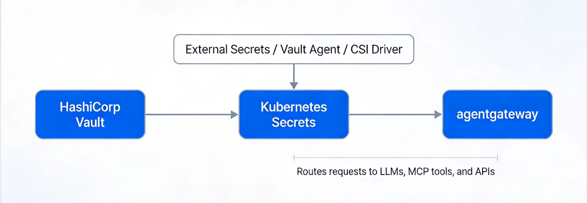

## Authentication Architecture

1.	Credentials Manager stores secrets and credentials for LLM providers, MCP servers, A2A backends, and any downstream APIs.
2.	Credentials Manager auth uses Kubernetes auth or another workload identity method so pods get short-lived access without static passwords.
3.	A secret delivery layer pushes selected secrets into Kubernetes Secrets or mounts them via a CSI/external-secrets mechanism.
4.	agentgateway runs in Kubernetes and reads those secrets from the cluster when building routes, backends, and policies.
5.	Traffic flows through agentgateway, which handles routing and policy enforcement while Credentials Manager stays out of the request path.

 
### Deployment pattern
**Credentials Manager -> Kubernetes Secrets -> agentgateway**

This is the simplest and most compatible design. Credentials Manager remains the backend of record, and something like External Secrets Operator or a CSI driver syncs values into Kubernetes Secrets. agentgateway then consumes Kubernetes-native secret references in its config, which matches the documented Kubernetes-first model

HashiCorp Vault is a Credentials Manager in the above diagram