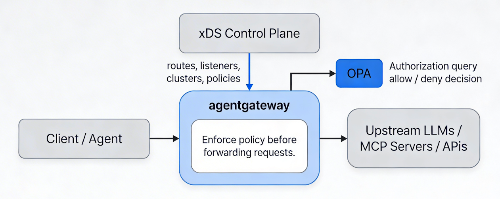
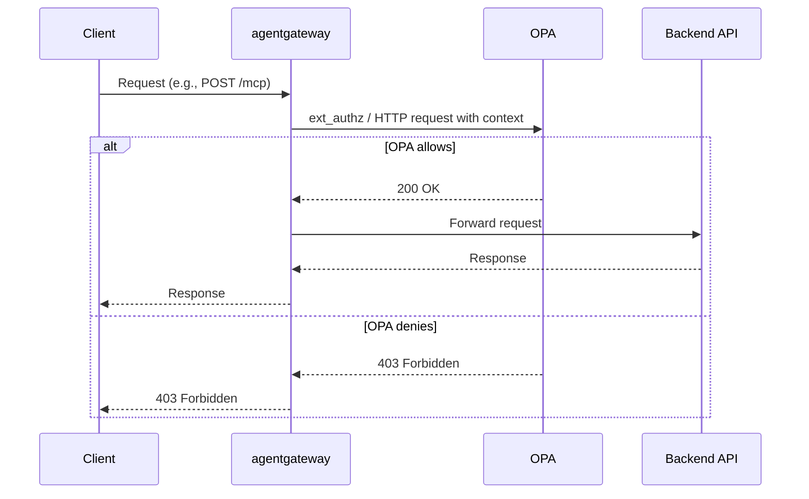

## Authorization Architecture

## OPA






**OPA Rego Policy Example**

```
package agentgateway.authz

import future.keywords.if

default allow := false

allow if {
    # Require valid Bearer token
    valid_jwt

    # Example RBAC: user.role == "admin" or "tool_runner"
    role := jwt.claims.role
    role in ["admin", "tool_runner"]
}

# You can also expose a separate package for MCP routes:
package agentgateway.mcp

default allow := false

allow if {
    # Based on MCP method, tool, user, etc.
    mcp_method := input.mcp_method
    mcp_tool := input.mcp_tool
    user := input.user
    # your business rules ...
}

```

### OPA AuthZ Config Example

```yaml
# yaml-language-server: $schema=https://agentgateway.dev/schema/config
binds:
- port: 3000

listeners:
- protocol: HTTP
  policies:
    extAuthz:
      # OPA HTTP‑based external authz
      http:
        host: opa.opa-system.svc.cluster.local:8181   # your OPA service
        path: /v1/data/agentgateway/authz/allow
        timeout: 2s
        # Include headers or CEL‑style metadata to pass context
        meta
          jwt: "{request.headers['Authorization']}"       # pass Bearer JWT
          user: "{cel(expression('jwt.claims.sub'))}"      # example JWT field extraction
          mcp_method: "{request.headers['Mcp-Method']}"    # MCP context header
          # agentgateway JWT audience / issuer enrichment if present
          # dev.agentgateway.jwt: '{\"claims\": jwt}'
      # What to do on 2xx vs non‑2xx
      allowOn:
        statusCode:
          range:
            start: 200
            end: 299
      denyOn:
        statusCode:
          range:
            start: 400
            end: 599
  routes:
  - name: mcp-protected-route
    matches:
    - path:
        pathPrefix: /mcp
    policies:
      # optional: override extAuthz at route level
      extAuthz:
        http:
          host: opa.opa-system.svc.cluster.local:8181
          path: /v1/data/agentgateway/mcp/allow
          # more granular context for this route
          meta
            mcp_tool: "{request.body.tool}"
            user: "{request.headers['X-User-ID']}"
    backends:
    - host: mcp.example.com:8080
      # Backend auth policy if needed
      policies:
        backendAuth:
          azure:
            # or any other provider key / token
            explicitConfig:
              client_secret:
                secretRef:
                  name: backend-credentials-secret

```

## Cedar

## Casbin

## Zanzibar/ OpenFGA