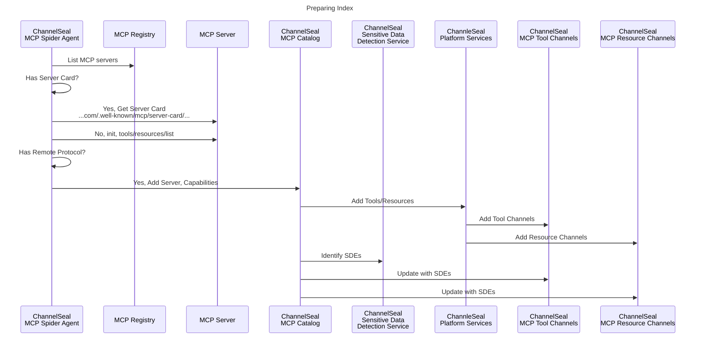
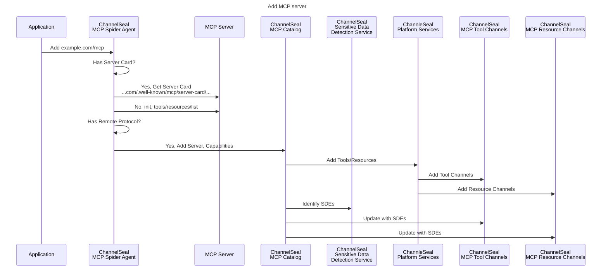
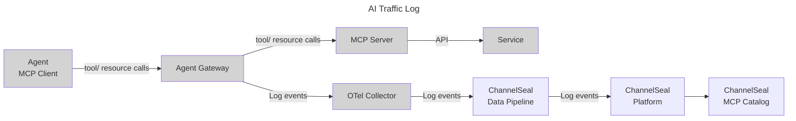

# ChannelSeal MCP Server Index

## Background

### MCP Regsitry Ecosystem

The MCP registry provides MCP clients with a list of MCP servers, like an app store for MCP servers.

There are two parts to the registry project:

1. 🟦 The MCP registry spec: An API specification that allows anyone to implement a registry.
2. 🟥 The Official MCP registry: A hosted registry following the MCP registry spec at `registry.modelcontextprotocol.io`. This serves as the authoritative repository for publicly-available MCP servers. Server creators publish once, and all consumers (MCP clients, aggregators, marketplaces) reference the same canonical data. This is owned by the MCP open-source community, backed by major trusted contributors to the MCP ecosystem such as Anthropic, GitHub, PulseMCP and Microsoft.

Find more details on [MCP Registry Ecosystem Vision](https://github.com/modelcontextprotocol/registry/blob/main/docs/design/ecosystem-vision.md)

## Use Spider to populate ChannelSeal MCP Index

## Add MCP Server to ChannelSeal MCP Index (ad-hoc)

## AI Agent traffic logs and ChannelSeal MCP Index

References:

1. [MCP Server Card - SEP-2127](https://github.com/modelcontextprotocol/modelcontextprotocol/blob/125fb1fd766b338c840b7d012aac89fd0a450042/seps/2127-mcp-server-cards.md)
2. [MCP Registry](https://github.com/modelcontextprotocol/registry/tree/main)
3. [Official MCP Registry](https://github.com/modelcontextprotocol/registry/blob/main/docs/reference/api/official-registry-api.md)
3. [MCP Server Discovery Flow](https://github.com/modelcontextprotocol/registry/blob/main/docs/design/tech-architecture.md#2-consumer-discovery-flow)

**Note:** Confidential and proprietary