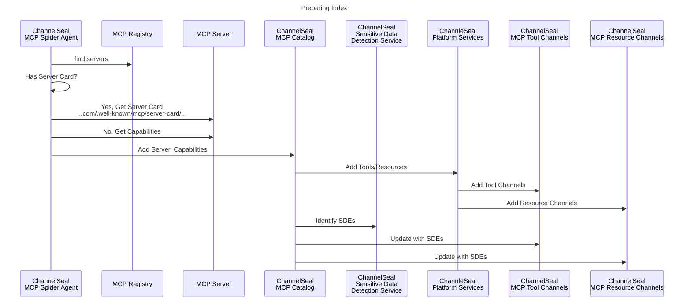
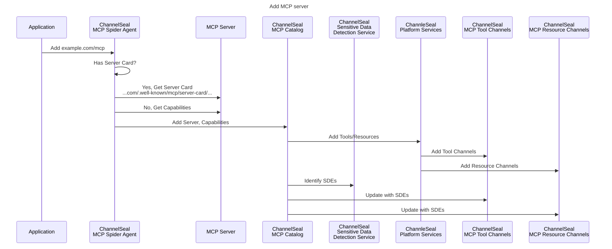
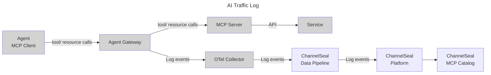

# ChannelSeal MCP Server Index

**Note:** This content is confidential and proprietary

## MCP Server indexing using spider

## Add MCP Server to index (ad-hoc)

## AI Agent Traffic Log Collection

