# Straw man: ChannelSeal MCP Server Index (MSI)

*Proprietary and confidential. (c) 2026, All rights reserverd.*

This document describes design of indexing MCP Server components in order to identify sensitive data flows from AI application traffic.

First, let's get some background on concepts/ technologies we would use.

## Background

### Model Context Protocol (MCP)

As AI applications gain mainstream adoption, the industry has invested heavily in large langauge model (LLM) capabilities, achieving rapid advances in inferencing, reasoning and quality. However, even the most sophisticated models are constrained by their isolation from data—trapped behind information silos and legacy systems. Every new data source requires its own custom implementation, making truly connected systems difficult to scale. [Model Context Protocol (MCP)](https://modelcontextprotocol.io/docs/getting-started/intro) addresses this challenge. MCP provides a universal, open standard for connecting AI systems with data sources, replacing fragmented integrations with a single protocol.


### MCP Architecture

The key participants in the MCP architecture are:

1. MCP Host: The AI application that coordinates and manages one or multiple MCP clients
2. MCP Client: A component that maintains a connection to an MCP server and obtains context from an MCP server for the MCP host to use
3. MCP Server: A program that provides context to MCP clients

```mermaid
flowchart LR
    User([👤 User]) --> Host

    subgraph Host["MCP Host"]
    LLM[🧠 LLM]
    Client[MCP Client]
    LLM <--> Client
    end
    
    Client <-->Server["⚙️ MCP Server"]
    
    style Host fill:#dbeafe,stroke:#3b82f6
    style Server fill:#dcfce7,stroke:#16a34a
```



For the context of this document, we would focus on MCP Server.

#### MCP Server

MCP servers are programs that expose specific capabilities to AI applications through standardized protocol interfaces. MCP server has 3 building blocks or primitives.

1. Tools: Functions that LLM can actively call, and decides when to use them based on user requests. Tools can write to databases, call external APIs, modify files, or trigger other logic.
2. Resources: Passive data sources that provide read-only access to information for context, such as file contents, database schemas, or API documentation.
3. Prompts: Pre-built instruction templates that tell the model to work with specific tools and resources.

```mermaid
flowchart LR
    User([👤 User]) --> Host
    
    subgraph Host["MCP Host"]
    LLM[🧠 LLM]
    Client[MCP Client]
    LLM <--> Client
    end
    
    Client <-->|JSON-RPC 2.0| Server
    
    subgraph Server["⚙️ MCP Server"]
    Tools[🔧 Tools]
    Resources[📁 Resources]
    Prompts[💬 Prompts]
    end
    
    Server --> DB[(Database)]
    Server --> API[🌐 API]
    Server --> FS[📂 Files]
    
    style Host fill:#dbeafe,stroke:#3b82f6
    style Server fill:#dcfce7,stroke:#16a34a
```




For the context of this document, we would focus on Resources and Tools.

##### MCP Resource

MCP provides a standardized way for servers to expose resources to clients. Resources allow servers to share data that provides context to language models, such as files, database schemas, or application-specific information.

An MCP [resource definition]() includes the following:

* `uri`: Unique identifier for the resource
* `name`: The name of the resource.
* `title`: Optional human-readable name of the resource for display purposes.
* `description`: Optional description
* `icons`: Optional array of icons for display in user interfaces
* `mimeType`: Optional MIME type
* `size`: Optional size in bytes

**Example**

```json
{
    "uri": "file:///project/src/main.rs",
    "name": "main.rs",
    "title": "Rust Software Application Main File",
    "description": "Primary application entry point",
    "mimeType": "text/x-rust",
    "icons": [
      {
        "src": "https://example.com/rust-file-icon.png",
        "mimeType": "image/png",
        "sizes": ["48x48"]
      }
    ]
}
```

##### MCP Tools

MCP allows servers to expose tools that can be invoked by language models. Tools enable models to interact with external systems, such as querying databases, calling APIs, or performing computations.

Each tool is uniquely identified by a name and includes [metadata](https://modelcontextprotocol.io/specification/2025-11-25/server/tools#tool) describing its schema as shown below.

* `name`: Unique identifier for the tool
* `title`: Optional human-readable name of the tool for display purposes.
* `description`: Human-readable description of functionality
* `icons`: Optional array of icons for display in user interfaces
* `inputSchema`: JSON Schema defining expected parameters
* `outputSchema`: Optional JSON Schema defining expected output structure
* `annotations`: Optional properties describing tool behavior

**Example**

```json
{
  "name": "get_weather_data",
  "title": "Weather Data Retriever",
  "description": "Get current weather data for a location",
  "inputSchema": {
    "type": "object",
    "properties": {
      "location": {
        "type": "string",
        "description": "City name or zip code"
      }
    },
    "required": ["location"]
  },
  "outputSchema": {
    "type": "object",
    "properties": {
      "temperature": {
        "type": "number",
        "description": "Temperature in celsius"
      },
      "conditions": {
        "type": "string",
        "description": "Weather conditions description"
      },
      "humidity": {
        "type": "number",
        "description": "Humidity percentage"
      }
    },
    "required": ["temperature", "conditions", "humidity"]
  }
}
```

#### MCP Server, A Shim For API

Enterprises have invested 15+ years into exposing enterprise capabilities (internal and external) with APIs. MCP, as exciting as it is, is really just a simple protocol `shim` for AI models to call tools. It is expected that most enterprises would expose their existing HTTP APIs as MCP tools to leverage this investment.

##### OpenAPI Operation Mapped To MCP Tool

Following table as described in [Exposing OpenAPI as MCP Tools - Semantics Matter](https://blog.christianposta.com/semantics-matter-exposing-openapi-as-mcp-tools/) provides practical mapping between OpenAPI attributes in MCP tool attributes.

| MCP Tool Element     | 	OpenAPI Source Field(s)	             | Notes |
|----------------------|---------------------------------------| -------- |
| name	                | operationId                           |	Unique, machine-friendly; fallback to method/path |
| title / description	 | summary / description                 |	Prefer summary for brevity, description for detail
| inputSchema          | 	parameters, requestBody	             | Structured input; includes types, constraints
| outputSchema	        | responses	                            | Structured output; success and error responses
| Invocation Details   | 	servers, path, method	               | URL, HTTP verb, server base
| Security             | 	security, components.securitySchemes |	Auth context for protected endpoints

Number of libraries, API design tools, API gateways, etc. are providing tools to generate MCP server from an API specification described in the OpenAPI format.

Check out this [Petstore MCP Server](./petstore_mcp.json) generated by Claude from [Petstore OpenAPI document](https://petstore3.swagger.io/api/v3/openapi.json).

MCP distinguishes tools (for actions like `POST`/`PUT`/`DELETE`, often with side effects) from resources (read-only data retrieval, typically `GET` for context like lists or queries).

### Search Index

Web search indexing is the process by which a search engine analyzes web pages and stores their information in a structured database (the “index”) so that results can be retrieved quickly when you run a query. Main steps involved
* Crawling: Automated programs (crawlers or spiders) discover pages by following links and sitemaps, downloading their content (HTML, images, etc.).
* Processing the content: The search engine parses the page, extracts text, links, titles, meta tags, alt text, and other key attributes, and may render the page to understand its structure.
* Analyzing and deduplicating: It determines what the page is about (keywords, topics), detects duplicates or near-duplicates, and chooses a canonical version to represent a cluster of similar pages.
* Storing in the index: The processed information is stored in large, specialized data structures (for example, inverted indexes that map words to the pages where they appear), optimized for very fast lookup.
* Continuous updating: The index is refreshed as pages are added, changed, or removed, so search results stay current and relevant.


### MCP Server Discovery

#### MCP Registry


The MCP registry provides MCP clients with a list of MCP servers, like an app store for MCP servers.

There are two parts to the registry project:

1. The MCP registry spec: An API specification that allows anyone to implement a registry.
2. The Official MCP registry: A hosted registry following the MCP registry spec at `registry.modelcontextprotocol.io`. This serves as the authoritative repository for publicly-available MCP servers. Server creators publish once, and all consumers (MCP clients, aggregators, marketplaces) reference the same canonical data. This is owned by the MCP open-source community, backed by major trusted contributors to the MCP ecosystem such as Anthropic, GitHub, PulseMCP and Microsoft.

Find more details on [MCP Registry Ecosystem Vision](https://github.com/modelcontextprotocol/registry/blob/main/docs/design/ecosystem-vision.md).

#### MCP Server Card

MCP clients currently lack efficient mechanisms to discover information about MCP servers before establishing a full connection. To obtain even basic metadata like server name and version, clients must complete an entire initialization handshake. This creates friction for discovery, integration, and optimization scenarios.

MCP Server Card is a standardized, self-contained format to describe MCP servers, e.g. for discovery using a `.well-known` endpoint. This enables clients to automatically discover server capabilities, available transports, authentication requirements, protocol versions and descriptions of primitives (prompts, resources, tools) before establishing a connection.

Find more details on  [MCP Server Card - SEP-2127](https://github.com/modelcontextprotocol/modelcontextprotocol/blob/125fb1fd766b338c840b7d012aac89fd0a450042/seps/2127-mcp-server-cards.md)

## MCP Server Indexing

### Rationale

MCP Server indexing is the process by which ChannelSeal would analyze MCP servers for sensitive data usage and store that information in a structured database (the “index”) so that it can be retrieved quickly while processing MCP traffic metadata without needing to inspect any payload.

To understand the approach, let's look at typical enterprise AI architecture and typical telemetry traffic involving MCP.

#### Enterprise AI Architecture

Typical enterprise AI architecture would be as following where enterprises would use agent gateway (e.g. [agentgateway](https://agentgateway.dev/)) for the following among other reasons.

* Security and access control: provides RBAC, JWT authentication, TLS, and CEL-based access policies GitHub purpose-built for agent workloads
* LLM provider portability: provides a unified OpenAI-compatible API across providers, enabling users to seamlessly switch between providers without changing application code — even dynamically based on the health or performance of a specific provider.
* LLM cost and rate limiting: performs rate limiting based on requests or tokens, with fully configurable time windows, applied at the level of individual clients, users, teams, environments, or models
* Observability: provides full OTel-based distributed tracing (spans for initialize, list_tools, call_tool), metrics, and structured access logs — all correlated by trace ID, with dynamic CEL-based span enrichment like jwt.sub, mcp.tool, and request.path.
* Governance

```mermaid
flowchart LR
    User([👤 User]) --> Host
    subgraph Host["MCP Host (AI Application)"]
        Client[MCP Client]
        LLM <--> Client
    end
    Client <--> MCPRouter
    subgraph MCPGateway["🔀 Agent Gateway"]
        LLMR[LLM Router]
        Memory[Context & Memory Store]
        LLMR <--> Memory
        MCPRouter[MCP Router & Multiplexer]
        MCPAuth[MCP AuthN/AuthZ]
        MCPRouter --> MCPAuth
        MCPRouter <--Data Flows--> MCPSUpstream[MCP Server Upstream]
        MCPRouter --Metadata (trace, log)--> MCPObs[OTel Telemetry]
    end
    LLM[🧠 LLM]<-->LLMR
    MCPSUpstream --Data flows-->Server["⚙️ MCP Server <br>example-mcp.com"]
    MCPObs --Metadata (trace, log)--> Observability["📊 Observability"]
    LLMR --> LLMProviders["☁️ LLM " <br> GPT, Claude, Gemini,... ]

    style Host fill:#dbeafe,stroke:#3b82f6
    style Server fill:#dcfce7,stroke:#16a34a
```



#### MCP Telemetry (Tool Call)

Following is an example of OpenTelemetry (OTel) Trace record as generated by an agent gateway or MCP client. As you can see that it would only contain metadata for the tool (or resource) calls (see key names with prefix: `mcp`, `http` and `url`).

```json
           {
              "traceId":      "286cb6c44380a45e1f77f29ce4d146fd",
              "spanId":       "ccddee1122334455",
              "parentSpanId": "aabbccddeeff0011",
              "name": "call_tool",
              "kind": 2,
              "startTimeUnixNano": "1740067205000000000",
              "endTimeUnixNano":   "1740067205042000000",
              "attributes": [
                { "key": "protocol",                           "value": { "stringValue": "mcp" } },
                { "key": "mcp.method",                         "value": { "stringValue": "tools/call" } },
                { "key": "mcp.tool",                           "value": { "stringValue": "echo" } },
                { "key": "mcp.server",                         "value": { "stringValue": "everything" } },
                { "key": "mcp.session_id",                     "value": { "stringValue": "6b497ee9-3710-428a-96d2-31ebeab73dcd" } },

                { "key": "http.request.method",                "value": { "stringValue": "POST" } },
                { "key": "http.route",                         "value": { "stringValue": "/mcp" } },
                { "key": "url.full",                           "value": { "stringValue": "http://example-mcp.com/mcp" } },
                { "key": "url.path",                           "value": { "stringValue": "/mcp" } },
                { "key": "url.scheme",                         "value": { "stringValue": "http" } },
                { "key": "http.response.status_code",          "value": { "intValue": "200" } },
                { "key": "http.request.body.size",             "value": { "intValue": "128" } },
                { "key": "http.response.body.size",            "value": { "intValue": "96" } },
                { "key": "http.request.header.content-type",   "value": { "arrayValue": { "values": [{ "stringValue": "application/json" }] } } },
                { "key": "http.request.header.accept",         "value": { "arrayValue": { "values": [{ "stringValue": "application/json, text/event-stream" }] } } },
                { "key": "http.request.header.mcp-session-id", "value": { "arrayValue": { "values": [{ "stringValue": "6b497ee9-3710-428a-96d2-31ebeab73dcd" }] } } },
                { "key": "http.request.header.authorization",  "value": { "arrayValue": { "values": [{ "stringValue": "Bearer eyJhbGci..." }] } } },
                { "key": "http.response.header.content-type",  "value": { "arrayValue": { "values": [{ "stringValue": "application/json" }] } } },
                { "key": "network.protocol.version",           "value": { "stringValue": "1.1" } },
                { "key": "network.peer.address",               "value": { "stringValue": "192.168.1.42" } },
                { "key": "network.peer.port",                  "value": { "intValue": "52341" } },
                { "key": "server.address",                     "value": { "stringValue": "gateway-node-1" } },
                { "key": "server.port",                        "value": { "intValue": "3000" } },
                { "key": "user_agent.original",                "value": { "stringValue": "mcp-client/1.0 (claude-desktop)" } },
                { "key": "client.address",                     "value": { "stringValue": "192.168.1.42" } },

                { "key": "environment",                        "value": { "stringValue": "production" } },
                { "key": "route",                              "value": { "stringValue": "/mcp" } }
              ],
              "status": { "code": 1 }
            }
```
In order to find sensitive data flow in communication between the MCP client and MCP server with or without an intermediary like agentgateway without peeking into the payload, ChannelSeal could rely on telemetry data and correlate the MCP traffic with its MCP Server Index. Following sections describe how we would build the index and use it for detecting sensitive data.

### MCP Server Index Architecture

Following are the main steps involved in MCP Server Indexing.

* Crawling for MCP Servers over web and MCP Server Registries with a spider
* Processing the MCP server metadata
* Analyzing the MCP server metadata to identify sensitive data types
* Storing senstive data elements, tools and resources for the MCP server in MCP Server Index
* Continuous updating of MCP Server Index by following the above steps

### Indexing MCP Tools

MSI would use the following attributes from an MCP tool in order to identify channel and sensitive data elements.

`name`, `title`, `description`, `inputSchema` and `outputSchema`

### Indexing MCP Resources

##### Does MCP Resource need to be indexed?

Many popular OpenAPI->MCP conversion tools semantically map operations as following:
* Actions (non-GET, or configurable GETs with params) become tools for AI invocation.
* Simple GETs default to resources for passive data access.

However, according to Claude:

Most real-world OpenAPI → MCP converters (awslabs.openapi-mcp-server, openapi-mcp-generator, Stainless, Higress) only generate tools, not resources. The dominant pattern treats every API endpoint as a tool, since MCP clients universally support tools but resource support varies widely. Stainless Resources are the right semantic fit for stable, addressable, read-only content — but in practice, the ecosystem has converged on tools-only for maximum compatibility.


### Building ChannelSeal MCP Server Index 

#### Use MCP Server Spider


#### Ad-hoc

Add MCP server into the index on an ad-hoc basis.


### Using MCP Server Index

Use case: Sensitive Data Detection in MCP Traffic


References:

1. [MCP Server Card - SEP-2127](https://github.com/modelcontextprotocol/modelcontextprotocol/blob/125fb1fd766b338c840b7d012aac89fd0a450042/seps/2127-mcp-server-cards.md)
2. [MCP Registry](https://github.com/modelcontextprotocol/registry/tree/main)
3. [Official MCP Registry](https://github.com/modelcontextprotocol/registry/blob/main/docs/reference/api/official-registry-api.md)
3. [MCP Server Discovery Flow](https://github.com/modelcontextprotocol/registry/blob/main/docs/design/tech-architecture.md#2-consumer-discovery-flow)
4. [Exposing OpenAPI as MCP Tools - Semantics Matter](https://blog.christianposta.com/semantics-matter-exposing-openapi-as-mcp-tools/)

**Note:** Confidential and proprietary